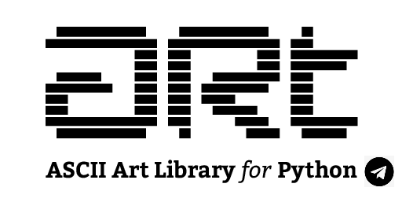

<div align="center">

</img>
<h1>Art Bot</h1>

<hr/>
<a href="https://www.python.org/"></a>
</div>		

## Overview	

Art bot is a free telegram bot for text converting to ASCII ART fancy.
To use it, just send your text to it.


## Run

### 0. Virtual Environment
Save your token into `.env` file like:
```
TELEGRAM_TOKEN='2025038828:AAHMH88MLDtLCbUKwVPPBbxoUp1cR3NZ7JA'
```
and then run bellow commands:
```
set -a
source .env
```

### 1. Installing Requirements
Run bellow command:
```
pip3 install -r requirements.txt
```

